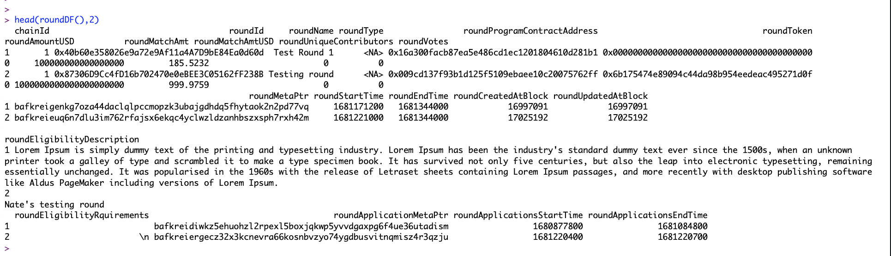
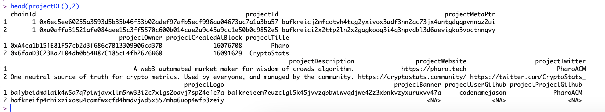
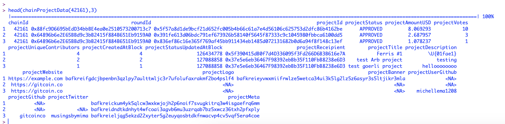
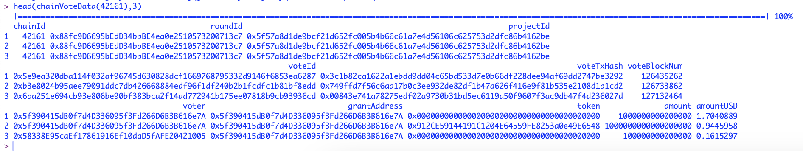
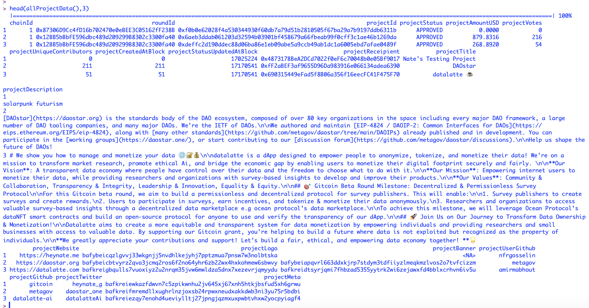
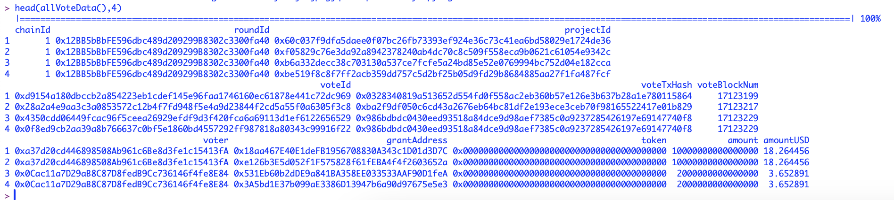

# alloDataR

Introducing an R Package for Effortless Interaction with Allo Protocol Indexer Data

Our R Package simplifies the process of accessing and utilizing Allo Protocol Indexer data for analysis in R while enabling seamless export to CSV files. This package takes the complex, nested JSON output from the indexer, collects, parses, and flattens it, resulting in easily accessible single tables. This streamlined data export capability broadens the community's ability to perform analysis, as the data can even be effortlessly loaded into Excel for further examination.

<br>

## [Walkthrough on YouTube](https://www.youtube.com/watch?v=hS9c5g) <<< Click Here

### Install this package using <br>
```
devtools::install_github("OmniacsDAO/alloDataR")
```


The Allo Protocol Indexer is a tool that indexes blockchain events generated by [Allo contracts](https://github.com/Allo-Protocol/contracts).
The indexed data have following structure.

```
/{chainId}/rounds.json
/{chainId}/prices.json
/{chainId}/projects.json
/{chainId}/rounds/{roundId}/projects.json
/{chainId}/rounds/{roundId}/projects/{projectId}/votes.json
/{chainId}/rounds/{roundId}/projects/{projectId}/contributors.json
/{chainId}/rounds/{roundId}/applications.json
/{chainId}/rounds/{roundId}/applications/{applicationIndex}/votes.json
/{chainId}/rounds/{roundId}/votes.json
/{chainId}/rounds/{roundId}/contributors.json
```

This R package pulls all the above data and makes it available for use in R and easy CSV downloads.
<br>

The package has 3 Functionalities
- [Pull Data : To pull all types of data for Allo Protocol](https://github.com/OmniacsDAO/alloDataR#pull-data-functionality)
- [Export Data : To export the Allo Protocol data](https://github.com/OmniacsDAO/alloDataR#data-export-functionality)

<hr>

## Pull Data Functionality

### Description

Our `alloDataR` R package contains the codebase that pulls and parses data from Allo Protocol Indexer output.

### Walkthrough

#### 1. Get Rounds DataFrame across all chains.

- `roundDF()`


<div align="center">Downloading Allo Protocol Rounds</div>


#### 2. Get Projects DataFrame across all chains.

- `projectDF()`


<div align="center">Downloading Allo Protocol Projects</div>


#### 3. Get Project wise Contribution Data for a given chain.

- `chainProjectData(42161)`


<div align="center">Project Contribution Data (Arbitrum)</div>


#### 4. Get all Contributions Data for a given chain.

- `chainVoteData(42161)`


<div align="center">Contribution Data (Arbitrum)</div>


#### 5. Get Project wise Contribution Data across all chains.

- `allProjectData()`


<div align="center">Project Contribution Data (All Chains)</div>


#### 6. Get all Contributions Data across all chains.

- `allVoteData()`


<div align="center">Contribution Data (All Chains)</div>


## Data Export Functionality

### Description

Our `alloDataR` R package contains the codebase to export any of the above data to use with any other tool.

### Walkthrough

#### Get Project wise Contribution Data across all chains
- `data <- allProjectData()`
- `write.csv(data,"~/allProjectData.csv")`


#### Get Vote wise Contribution Data across all chains
- `data <- allVoteData()`
- `write.csv(data,"~/allVoteData.csv")`
